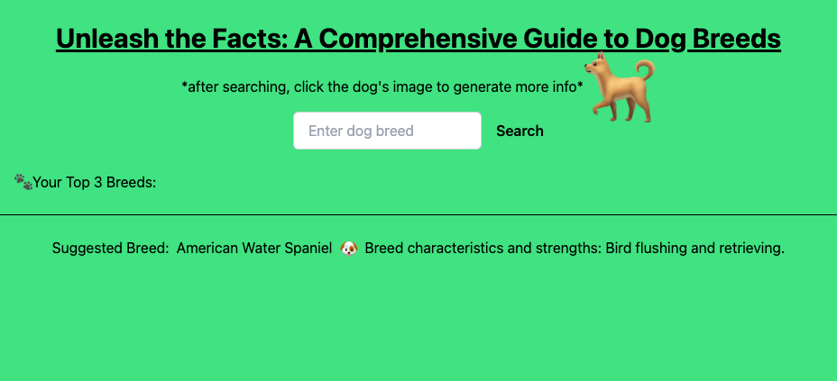

# Unleash the Facts

## README

This application is a simple application to be used to educate users on user searched dog breeds. The application functions by taking a users breed name input (if an invalid breed name is entered, a modal will appear notifying the user), displaying a max of three images of the breed or closely related breeds, which will display a modal when clicked, presenting the user with relevant information about the breed represented in the image. The modal will allow the user to favorite the dog breed, which will then be displayed in the list titled "Your Top 3 Breeds:". On the bottom of the page is a banner updating at a regular interval presenting the user with the name of the dog breed, and their most defining strength or characteristic. This is to help give the users ideas on what to search, and present them with more intersting information.

How to use this application:

    - Type your search into the search bar under the title of the page and click search.

    - Click on one of the displayed images to present a modal containing breed information.

    - Click favorite on the modal to save the breed to your top three favorites.

    - Click the close button within the modal to close it, and enter another search query.

### CONTACT

To contact the developers reach out to us through our GitHub respository [here.](https://github.com/hansonsteven26/Melody-Muse)